<div align="center">

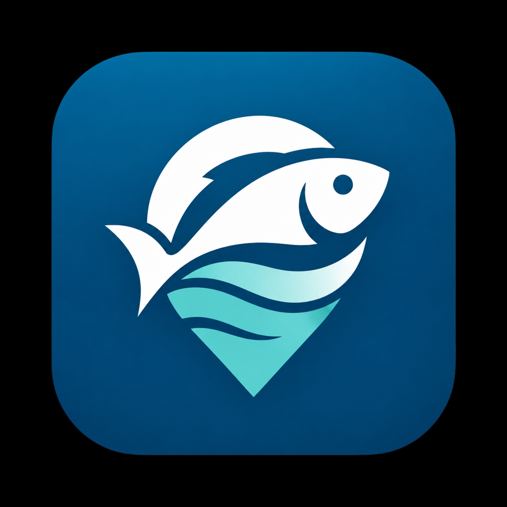

**Catch. Connect. Get a Fair Price.**

[](https://swift.org)
[](https://developer.apple.com/xcode/swiftui/)
[](#)
[](#)
[](#web-prototype)
[](#)
[](#license)

*A documented, price-checked alternative to consignacion — one catch at a time.*

</div>

---

## Table of Contents

<details>
<summary>Click to expand</summary>

1. [Overview](#overview)
2. [Background & Problem](#background--problem)
3. [What Palakaya Does](#what-palakaya-does)
4. [Intended Users & Stakeholders](#intended-users--stakeholders)
5. [Core Features](#core-features)
6. [System Illustration](#system-illustration)
7. [Scope & Boundaries](#scope--boundaries)
8. [Tech Stack](#tech-stack)
9. [Project Structure — iOS App](#project-structure--ios-app)
10. [Data Models](#data-models)
11. [Design System](#design-system)
12. [Web Prototype](#web-prototype)
13. [Figma Prototype](#figma-prototype)
14. [Getting Started](#getting-started)
15. [Roadmap](#roadmap)
16. [References](#references)
17. [License](#license)

</details>

---

## Overview

<div align="center">
  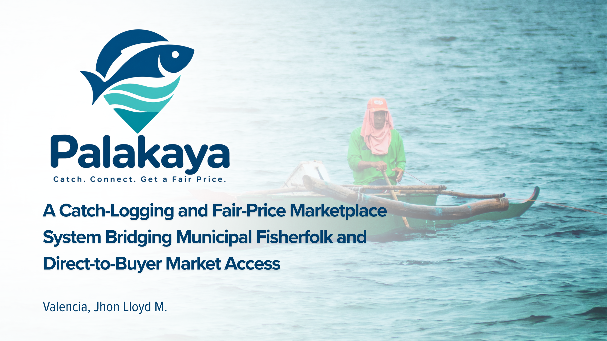
</div>

<br/>

**Palakaya** is a dual-purpose catch-logging and fair-price marketplace system built to close a structural market-access gap facing small-scale Filipino fishers: fishers have no direct channel to reach buyers at a fair, transparent price, and neither the Bureau of Fisheries and Aquatic Resources (BFAR) nor local government fisheries offices have real-time visibility into where catch volumes and market prices are diverging from what fishers actually receive.

The app lets a fisher log each catch by species, weight, fishing ground, and date/time immediately upon landing, checks every listed catch against a rolling **fair-price benchmark**, matches fishers directly with verified buyers, and scores every completed sale for **price alignment** against that benchmark. Every price-checked transaction simultaneously feeds anonymized, aggregated regional data back to BFAR and LGU fisheries offices — the fisher-facing tool *is* the mechanism by which that government-facing data gets collected.

This repository contains two artifacts of the same project:

- **`Palakaya/`** — a native **SwiftUI + SwiftData** iOS app implementing the full product.
- **A standalone HTML/CSS/JS prototype** ([`palakaya-2.html`](#web-prototype)) — a single-file, phone-frame simulation of the same flows, used for early design iteration.

> **Capstone Project (BSCS III, 2026)** — Manuel S. Enverga University Foundation, Lucena City
> Valencia, Jhon Lloyd M. · `jhonlloydval@gmail.com`

---

## Background & Problem

<div align="center">
  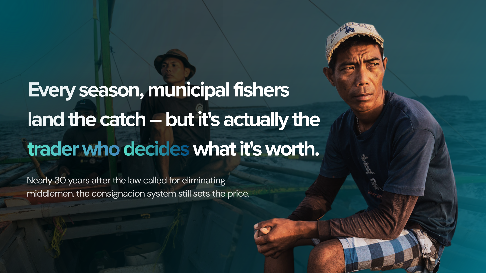
</div>

<br/>

The Philippines is among the most marine-biodiverse nations in the world and has long depended on capture fisheries as a primary source of food, protein, and coastal livelihood. Despite this:

- National fish production declined by almost **600,000 metric tons** between 2010 and 2023, with an estimated **45 million kilos** of fish lost annually to weak law enforcement and governance failures — pushing more than **350,000 fishing families** below the poverty line as of 2023.
- Municipal fishers — the majority of the sector's workforce — rely on the **consignacion system**, in which traders or landing-center operators consolidate and sell catch on consignment, concentrating pricing power with the trader rather than the fisher who bears the risk and labor.
- The Philippine Fisheries Code (**Republic Act No. 8550**) recognized this imbalance as early as 1998, mandating the elimination of middlemen through collective marketing — and the later **Sagip Saka Act (RA 11321)** is itself evidence the problem persists more than two decades on.
- Following the 2026 Iran war, local fuel prices climbed from PHP 400–550 to as high as **PHP 1,200 per 10 liters**, shortening or ending trips for many small-scale fishers despite a one-time PHP 3,000 government subsidy.
- The sector is aging rapidly — the average Filipino fisherman is now **49–52 years old** — amid monthly incomes as low as **PHP 2,500–7,000**, and fishers in contested maritime areas face an added layer of risk that has made some traditional grounds effectively inaccessible.

Prior digital tools show promise but stop short of closing the loop: **ISDApp** delivers offline weather advisories but has no catch logging or market connection; the **Fish Landing app** lets fishers log species and grounds but never connects that data to a buyer; **FishLink**, a locally piloted web app, tested market linkage but remained isolated to a single Misamis Occidental municipality. International platforms like India's **Fisher Friend Mobile Application** and **ABALOBI** have shown that combining catch tracking with direct market linkage can measurably improve a fisher's bargaining position — but no existing tool applies that model to Filipino municipal fisheries specifically.

---

## What Palakaya Does

<div align="center">
  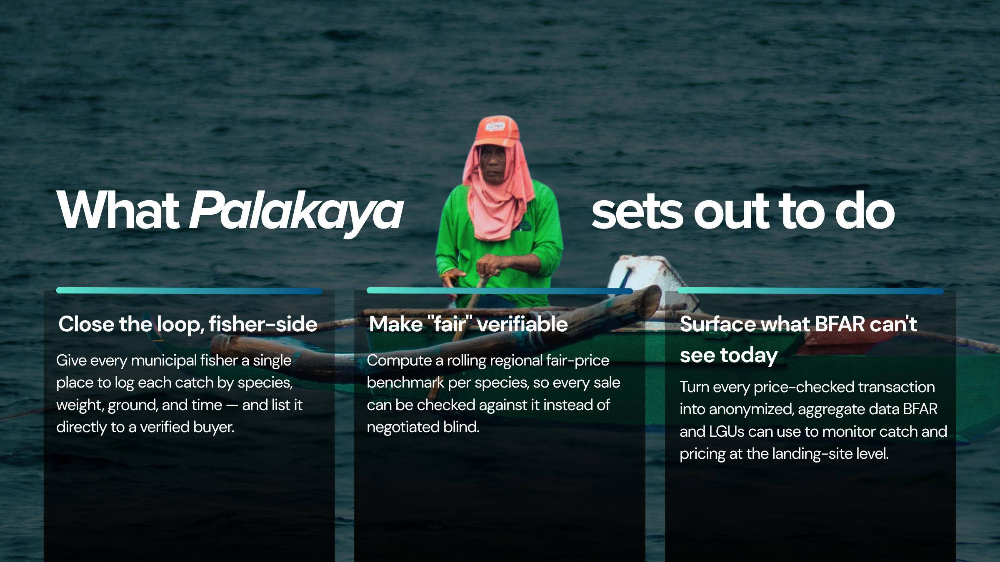
</div>

<br/>

Palakaya closes the gap on both ends:

- **Close the loop, fisher-side** — give every municipal fisher a single place to log each species, weight, ground, and time, and list it directly to a verified buyer.
- **Make "fair" verifiable** — compute a rolling regional fair-price benchmark per species, so every sale can be checked instead of negotiated blind.
- **Surface what BFAR can't see today** — turn every price-checked transaction into anonymized, aggregate data BFAR and LGUs can use to monitor and target support at the landing-site level.

---

## Intended Users & Stakeholders

<div align="center">
  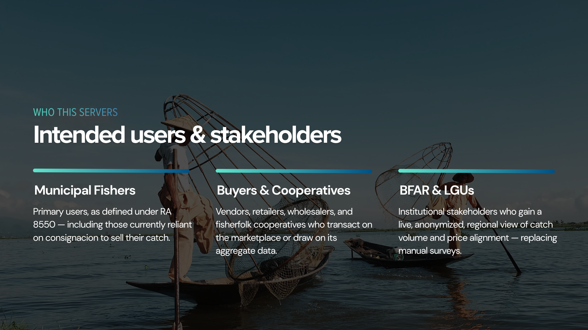
</div>

<br/>

| Group | Role |
|---|---|
| **Municipal Fishers** | Primary users, as defined under RA 8550 — including those currently reliant on consignacion to sell their catch |
| **Buyers & Cooperatives** | Vendors, retailers, wholesalers, and fisherfolk cooperatives who transact on the marketplace or draw on its aggregate data |
| **BFAR & LGUs** | Institutional stakeholders who gain a live, anonymized regional view of catch volume and price alignment, replacing manual surveys |

---

## Core Features

Palakaya's operational structure is built around nine interlocking processes, moving a fisher from a landed catch to a documented, price-checked sale.

### 1. Fisher Profile & Registration

<div align="center">
  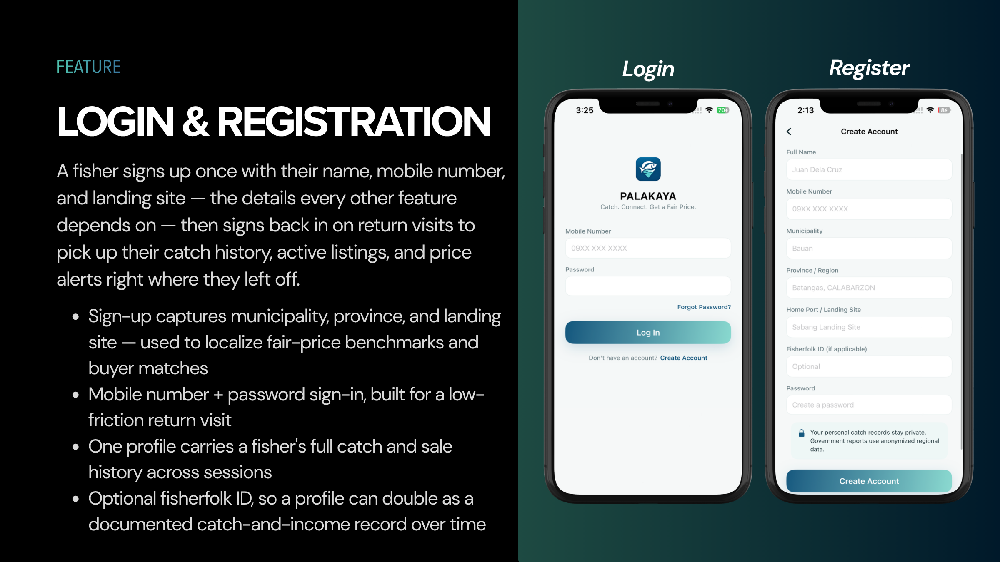
</div>

<br/>

- Sign-up captures full name, mobile number, landing site, municipality, and province — used to localize fair-price benchmarks and buyer matches.
- Mobile number + password sign-in, built for low-friction return visits.
- One profile carries a fisher's full catch and sale history across sessions; an optional Fisherfolk ID field allows a profile to double as a documented catch-and-income record over time.

### 2. Digital Catch Logging

<div align="center">
  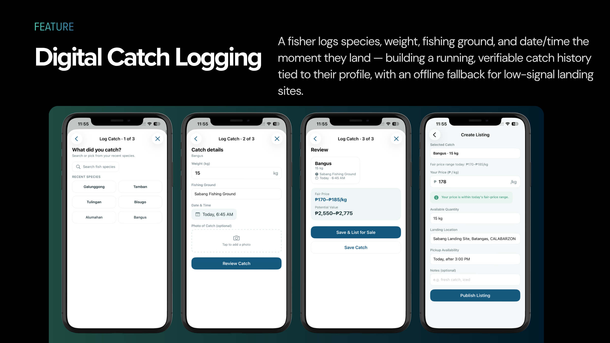
</div>

<br/>

A fisher logs species, weight, fishing ground, and date/time the moment they land — building a running, verifiable catch history tied to their profile, with an offline fallback for low-signal landing sites.

### 3. My Catch

<div align="center">
  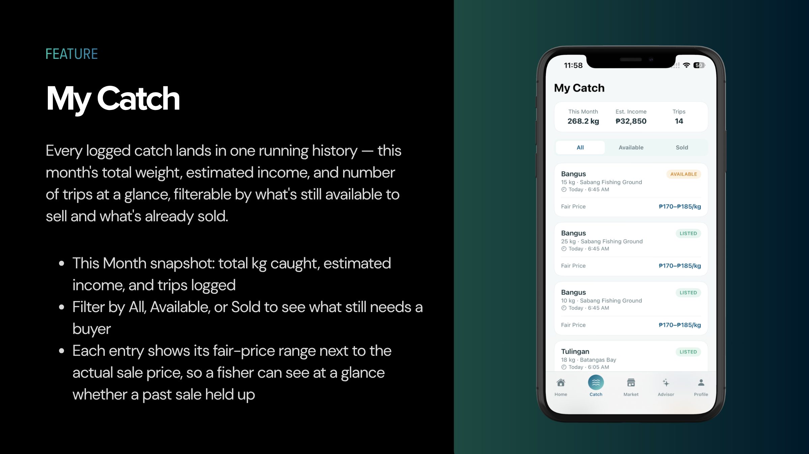
</div>

<br/>

- "This month" snapshot: total kilos caught, estimated income, and trip count at a glance.
- Filterable by **All**, **Available**, or **Sold** to see what still needs a buyer.
- Each entry shows its fair-price range next to the actual sale price, so a fisher can see at a glance whether a past sale held up.

### 4. Fair-Price Benchmarking Engine

<div align="center">
  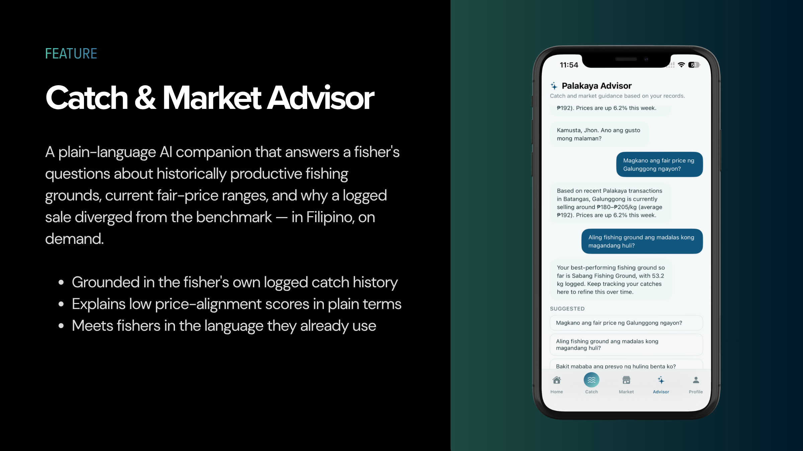
</div>

<br/>

- A rolling regional reference range per species, computed from aggregated recent marketplace transactions and refreshed as new sales are logged.
- Shown as a **regional range, not a single guess** — visible to the fisher before they ever agree to sell.
- Flags species/regions with too little transaction data to trust yet; the more sales logged, the more accurate the benchmark becomes.

### 5. Marketplace Listing & Buyer Matching

<div align="center">
  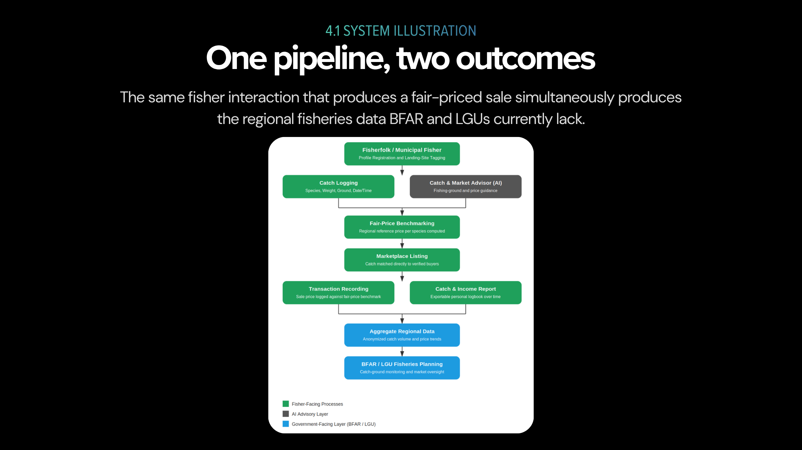
</div>

<br/>

- A fisher lists landed catch directly to verified vendors, retailers, and cooperatives — bypassing consignacion.
- Listings are matched by species, quantity, and proximity to the fisher's landing site.
- Offers are flagged **"within benchmark"** or **"below fair price"**; buyer verification status and ratings are visible up front.

### 6. Transaction Recording & Price-Alignment Scoring

<div align="center">
  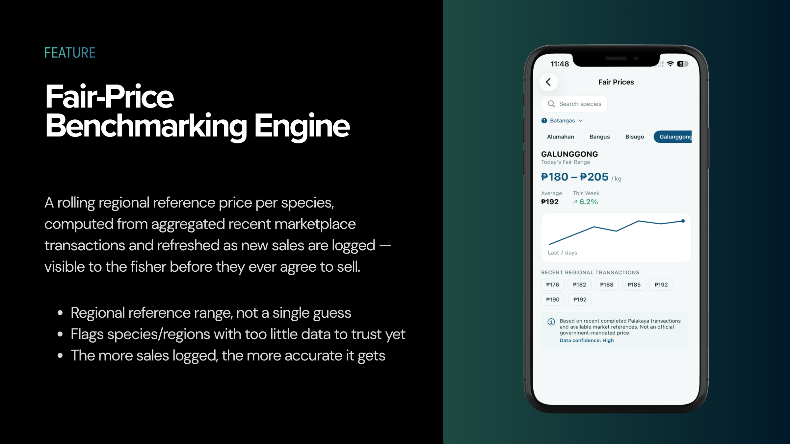
</div>

<br/>

- Once a fisher accepts a buyer's offer, the agreed price and quantity are recorded and instantly checked against the fair-price benchmark.
- Produces a **price-alignment score** for that sale — turning every completed transaction into a fairness check instead of a one-off, unverifiable exchange.
- Divergent sales are flagged and routed to the Catch & Market Advisor for a plain-language explanation.

### 7. Catch & Market Advisor (AI Companion)

<div align="center">
  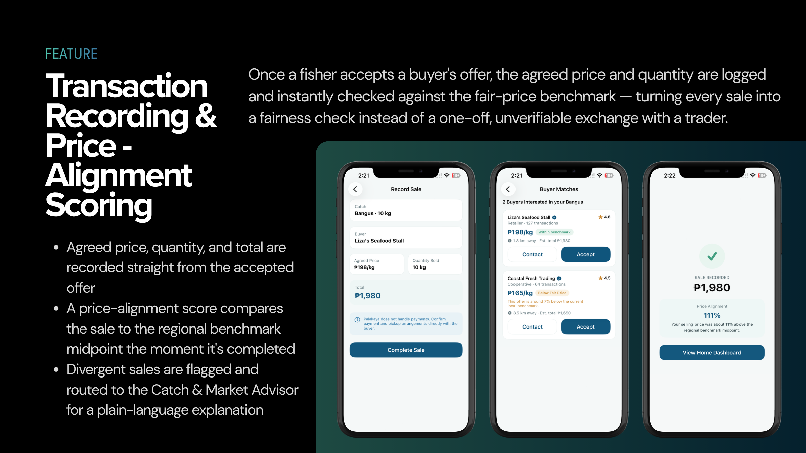
</div>

<br/>

- A plain-language AI companion, grounded in a fisher's own logged catch history, that answers questions about historically productive fishing grounds and current fair-price ranges.
- Explains *why* a logged sale diverged from the benchmark.
- Meets fishers in the language they already use (Filipino/Tagalog-first).

### 8. Catch & Income Reports

<div align="center">
  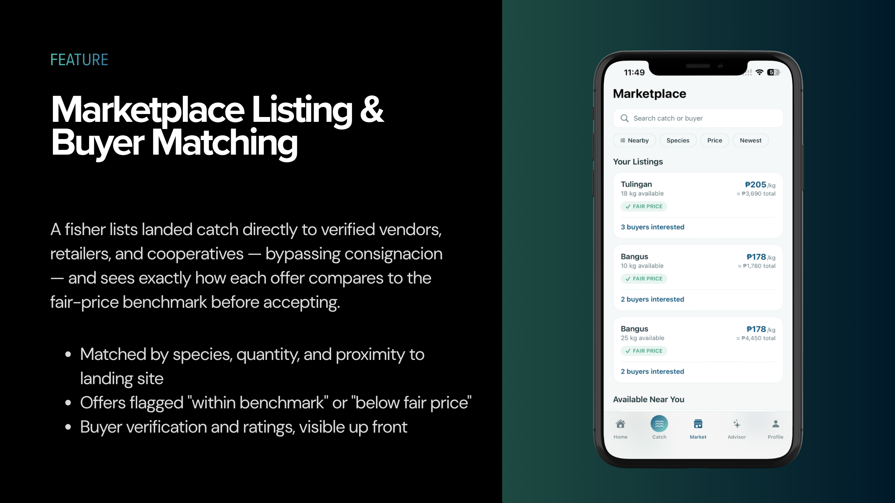
</div>

<br/>

- Consolidates a fisher's catch history, transaction log, and price-alignment trend into a savable, exportable personal report — monthly totals, average price alignment, and top species.
- Exportable and shareable on demand; the same records roll up into the BFAR/LGU aggregate reporting layer.

### 9. Buyer Verification

- Verifies buyer registration details (vendor / retailer / cooperative status).
- Surfaces buyer ratings and transaction history to fishers before a listing is agreed.
- Flags buyer accounts associated with repeated below-benchmark offers.

### Low-Bandwidth / Offline Entry

Full marketplace listing, benchmarking, and report generation require an internet-enabled device. An **SMS/USSD fallback** (`*143#`) is provided for **manual catch entry and fair-price lookup only** when connectivity is unavailable at the landing site, syncing automatically once the fisher is back online.

---

## System Illustration

<div align="center">
  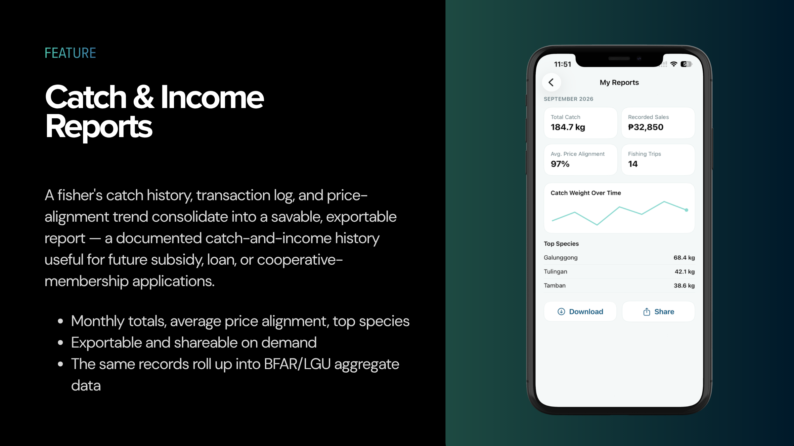
</div>

<br/>

The figure traces how a single fisher interaction becomes both a fisher-facing marketplace transaction and government-facing fisheries data. A fisher registers a profile and logs a catch by species, weight, ground, and date, while the Catch & Market Advisor concurrently analyzes historical patterns to recommend fishing grounds and expected prices. Both streams feed the fair-price benchmarking step, which informs a marketplace listing and a buyer match. Once a sale completes, it's recorded and checked against the benchmark to produce a price-alignment score, consolidated alongside the fisher's ongoing catch history into an exportable report. At the aggregate level, price-checked transaction data rolls up into anonymized regional data that informs BFAR and LGU fisheries planning — the same pipeline that helps a fisher get a fair price simultaneously produces the data government agencies currently lack.

---

## Scope & Boundaries

<div align="center">
  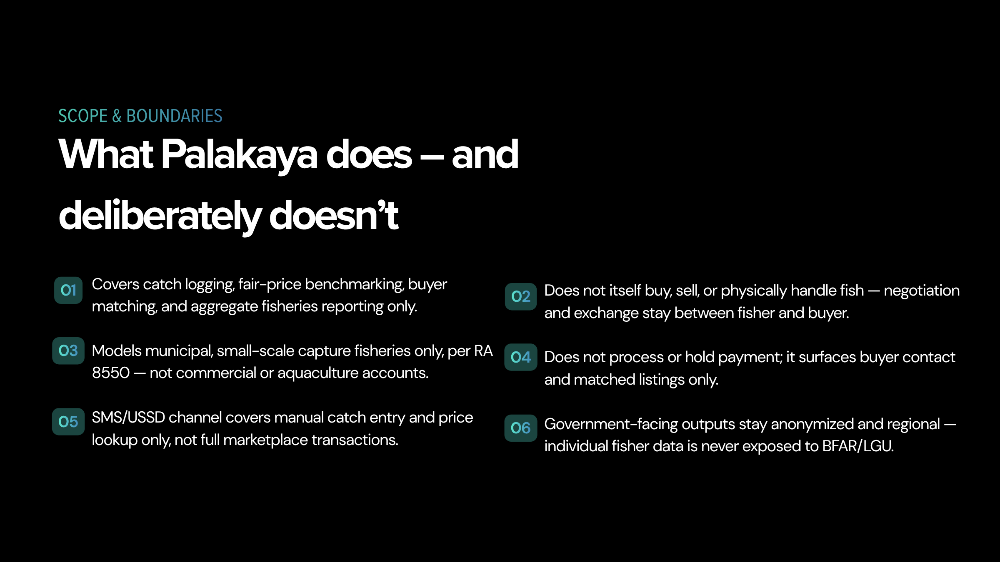
</div>

<br/>

**Palakaya does:**
- Cover catch logging, fair-price benchmarking, buyer matching, and aggregate fisheries reporting end-to-end.
- Model **municipal, small-scale capture fisheries only**, consistent with RA 8550's definition.
- Provide an SMS/USSD channel for manual catch entry and fair-price lookup only.

**Palakaya deliberately does not:**
- Itself buy, sell, or physically handle fish, negotiate, or mediate the exchange between fisher and buyer.
- Process or hold payment — it surfaces buyer contact and matched listings; payment and delivery are arranged directly between fisher and buyer.
- Extend to commercial fishing operators or aquaculture accounts.
- Expose individual fisher identities or raw transaction data to BFAR or LGU users — government-facing outputs are anonymized and aggregated at the regional level only.

---

## Tech Stack

| Layer | Technology |
|---|---|
| **iOS App UI** | SwiftUI (`@Observable` state, `NavigationStack`, sheets/detents) |
| **iOS App Persistence** | SwiftData (`ModelContainer` / `@Model`) — on-device storage, no backend required |
| **iOS App Language** | Swift 5.10, iOS 17+ |
| **Web Prototype** | Single-file HTML5 + CSS custom properties + vanilla JavaScript (no build step, no dependencies) |
| **Design Prototyping** | Figma |

---

## Project Structure — iOS App

```
Palakaya/
├── Palakaya.xcodeproj/
└── Palakaya/
    ├── App/
    │   ├── PalakayaApp.swift        # @main entry point, SwiftData ModelContainer, demo-account seeding
    │   ├── RootView.swift           # Top-level phase switch (onboarding/login/register/main)
    │   ├── MainTabView.swift        # 5-tab navigation shell + custom tab bar
    │   └── AppState.swift           # @Observable app-wide session/navigation/form state
    │
    ├── Components/
    │   ├── Theme.swift              # Color palette, buttons, shared UI primitives
    │   └── SparklineChart.swift     # Lightweight trend chart component
    │
    ├── Models/
    │   ├── Models.swift             # SwiftData @Model types: UserAccount, CatchRecord, AdvisorMessageRecord
    │   └── StaticData.swift         # Seed/reference data (fair-price DB, buyers, etc.)
    │
    └── Views/
        ├── Onboarding/              # OnboardingView, LoginView, RegisterView
        ├── Home/                    # HomeView, NotificationsSheetView
        ├── Catch/                   # MyCatchView, LogCatchFlowView, CatchDetailsView
        ├── Market/                  # MarketView, CreateListingView, ListingDetailsView,
        │                            # OtherListingDetailsView, BuyerMatchesView, PriceExplorerView
        ├── Sales/                   # RecordSaleView, SaleRecordedView
        ├── Reports/                 # AdvisorView, ReportsView
        └── Profile/                 # ProfileView
```

The app is organized around a 5-tab shell (**Home · Catch · Market · Advisor · Profile**) driven by a single `AppState` observable object and a `NavigationStack` with a typed `Route` enum, mirroring the screen flow first validated in the HTML prototype.

---

## Data Models

SwiftData `@Model` classes defined in `Models/Models.swift`:

```swift
@Model final class UserAccount {
    var fullName: String
    var mobile: String
    var password: String
    var municipality: String
    var province: String
    var landingSite: String
    var fisherfolkID: String
    var createdAt: Date
}

@Model final class CatchRecord {
    var species: String
    var weight: Double
    var ground: String
    var timeLabel: String
    var dateLogged: Date
    var statusRaw: String          // available | listed | sold
    var price: Double?
    var saleAmount: Double?
    var buyerName: String?
    var alignment: Int?            // price-alignment score
    var buyersInterested: Int?
    var hasPhoto: Bool
}

@Model final class AdvisorMessageRecord {
    var isUser: Bool
    var text: String
    var timestamp: Date
}
```

On first launch, `PalakayaApp` seeds a demo fisher account (`Mang Jose Dela Cruz`) and four sample catch records so the app is fully explorable without manual setup.

---

## Design System

The app's palette is centralized in `Components/Theme.swift` and mirrors the web prototype's CSS custom properties exactly, built around a deep-sea-to-aqua brand gradient.

| Token | Hex | Usage |
|---|---|---|
| `pkDark` | `#085078` | Primary brand — buttons, active states, gradient start |
| `pkAqua` | `#85D8CE` | Gradient end, secondary accents |
| `pkNavy` | `#07344C` | Deep accents |
| `pkBg` | `#F5F8F8` | Page backgrounds |
| `pkSurface` | `#FFFFFF` | Cards, sheets |
| `pkSurface2` | `#EDF7F6` | Secondary surfaces, static rows |
| `pkText` | `#10272D` | Primary text |
| `pkSub` | `#667A80` | Secondary / muted text |
| `pkBorder` | `#DDE9E8` | Dividers, input borders |
| `pkSuccess` / `pkSuccessBg` | `#3E9C7D` / `#E7F5EF` | Positive status (e.g. within benchmark) |
| `pkWarning` / `pkWarningBg` | `#C9852B` / `#FCF2E1` | Caution status |
| `pkDanger` / `pkDangerBg` | `#C9483E` / `#FBEAE8` | Below-benchmark / error status |
| `pkInfo` / `pkInfoBg` | `#1F6FA3` / `#E7F1F7` | Informational callouts |

---

## Web Prototype

<div align="center">
  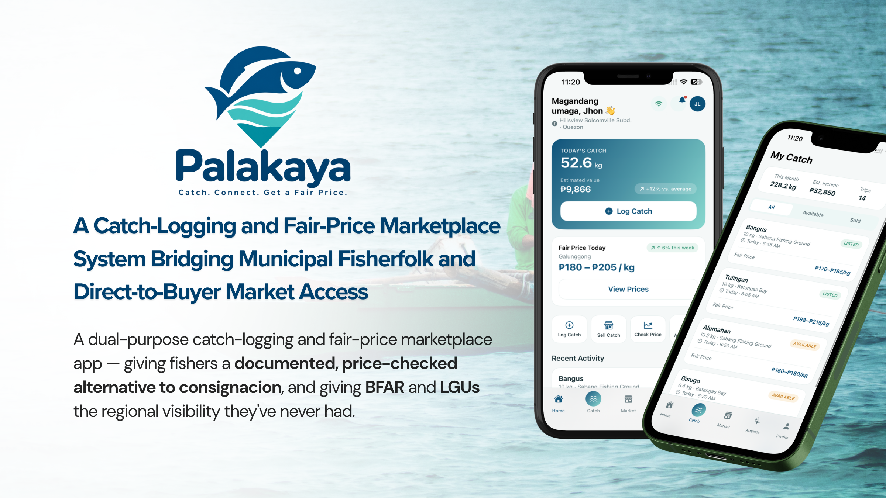
</div>

<br/>

Alongside the iOS app, the repository includes a standalone HTML/CSS/JS prototype (single file, no build step or dependencies) that simulates the same product inside a phone-frame browser mockup. It was used to iterate on flows and screens — onboarding, login/register, home, catch logging & editing, marketplace, buyer matching, sale recording, price explorer, reports, chat, connectivity/offline settings, SMS/USSD simulator, privacy, help center, and about — before they were implemented natively in SwiftUI.

To view it, simply open the HTML file in a browser:

```bash
open palakaya-2.html
```

---

## Figma Prototype

An interactive Figma prototype tracking the same flows is published at:

**[cod-wave-02815321.figma.site](https://cod-wave-02815321.figma.site)**

---

## Getting Started

### Prerequisites

- Xcode 15+ (Swift 5.10, iOS 17 SDK or later)
- macOS with Xcode command-line tools installed
- An iOS Simulator or physical device running iOS 17+

### Installation

```bash
# 1. Clone the repository
git clone https://github.com/your-org/palakaya.git
cd palakaya/Palakaya

# 2. Open the Xcode project
open Palakaya.xcodeproj

# 3. Select a simulator (e.g. iPhone 15 Pro) and run (⌘R)
```

No backend, API keys, or `.env` configuration are required — the app runs entirely on-device using SwiftData, with a demo account seeded automatically on first launch (mobile: `0917 234 5678`, password: `password`).

---

## Roadmap

<div align="center">
  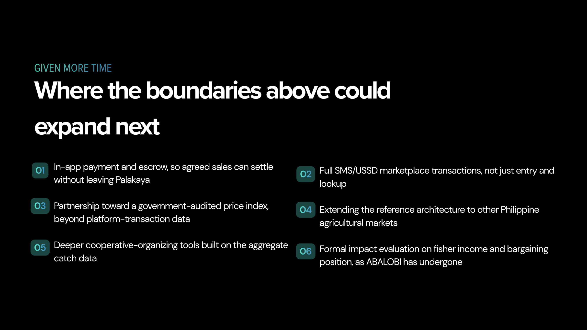
</div>

<br/>

| Feature | Status |
|---|---|
| Fisher profile, catch logging, and catch history | ✅ Complete |
| Fair-price benchmarking engine | ✅ Complete |
| Marketplace listing & buyer matching | ✅ Complete |
| Transaction recording & price-alignment scoring | ✅ Complete |
| Catch & Market Advisor (AI companion, static demo) | ✅ Complete |
| Catch & income report generation | ✅ Complete |
| SMS/USSD low-bandwidth simulator | ✅ Complete |
| Native SwiftUI/SwiftData iOS implementation | ✅ Complete |
| In-app payment & escrow so sales can settle without leaving Palakaya | 🔜 Planned |
| Full SMS/USSD marketplace transactions (not just entry & lookup) | 🔜 Planned |
| Partnership toward a government-audited price index | 🔜 Planned |
| Extending the reference architecture to other Philippine agricultural markets | 🔜 Planned |
| Deeper cooperative-organizing tools built on aggregate catch data | 🔜 Planned |
| Formal impact evaluation on fisher income and bargaining position, as ABALOBI has undergone | 🔜 Planned |

---

## References

- Beato, O. H. (2026, April 6). *Iran war pushes Philippines fishing communities to the brink.* The New Humanitarian.
- Cooperative Development Authority. (2021, August 9). *Fisherfolk marketing cooperatives: Empowered partners of BFAR towards fish sufficiency and food security.*
- Food and Agriculture Organization & WorldFish. (2020). *Information and communication technologies for small-scale fisheries (ICT4SSF): A handbook for fisheries stakeholders.* FAO.
- IndexBox. (2026, June 4). *Philippine fishermen crisis 2026: Declining catches, commercial vessels, fuel costs.*
- National Fisheries Research and Development Institute. (2024, May 20). *ISDApp: Empowering fisherfolk with accessible weather information.* Department of Agriculture.
- Philippine Institute for Development Studies. (2023). *Transforming Philippine agri-food systems with digital technologies* (Discussion Paper Series No. 2023-29).
- Philippine News Agency. (2026, January 12). *Protecting Filipino fishermen not an act of escalation, PH tells China.*
- Philstar.com. (2026, February 5). *Philippines fisheries near collapse as 45 million kilos lost annually.*
- Rappler. (2026, February 14). *Rappler Talk: What the world can learn from Philippine seas* [Interview with A. J. Ferrer].
- Regional Environmental Change. (2021). *Institutions and institutional changes: Aquatic food production in Central Luzon, Philippines.* 21(4), Article 127.
- Reuters. (2026, July 10). *A decade after historic ruling, Philippine fishermen say driven away from disputed shoal by China.* U.S. News & World Report.
- Stanford Center for Ocean Solutions. (2021). *Digital platforms empowering small-scale fishers.* Stanford University.
- Universitas Multi Data Palembang Student Conference. (2026). *FishLink: Bridging consumers direct to fishermen's catch* [Conference paper].

---

## License

Private and proprietary — capstone project. All rights reserved. Unauthorized use, reproduction, or distribution of any part of this codebase is strictly prohibited unless otherwise agreed with the author.

---

<div align="center">

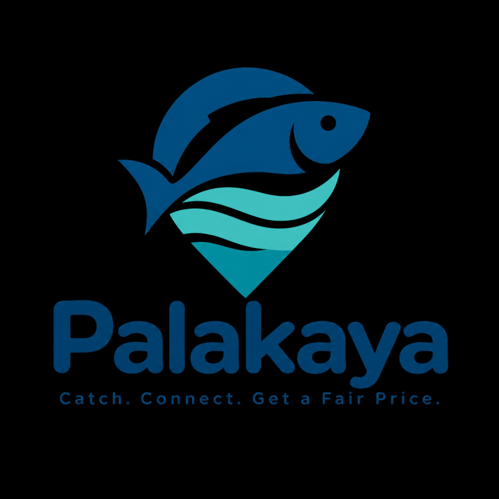

**Palakaya** — BSCS III Capstone, 2026 · Manuel S. Enverga University Foundation, Lucena City

*Catch. Connect. Get a Fair Price.*

</div>
